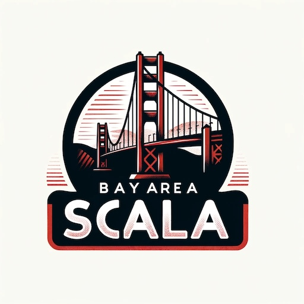

# Join the Bay Area Scala Enthusiasts!

Calling all Scala developers in the San Francisco Bay Area! Whether you're a seasoned professional or just starting your functional programming journey, the Bay Area Scala Enthusiasts is the place for you.

## We're a passionate group dedicated to:

- *Sharing knowledge:* Join us for informative tech talks led by industry experts, where you'll learn about the latest advancements in Scala and functional programming.
- *Deep dives:* Dive deeper with our book clubs, where we'll explore influential Scala and functional programming texts together.
- *Collaborative coding:* Put your skills to the test and innovate with fellow Scala Enthusiasts at our hackathons.

## Our mission is to:

- *Spread the love for Scala:* We're passionate about Scala and its potential, and we want to share that enthusiasm with the Bay Area developer community.
- *Empower AI development with Scala:* We believe Scala's power and expressiveness make it an ideal language for building next-generation AI applications.
- *Grow the Scala community:* By providing a platform for learning, collaboration, and innovation, we aim to increase Scala adoption in the region.
Join us and be part of the Bay Area's vibrant Scala scene!

## Subscribe to our [calendar](https://lu.ma/scala) here to be informed of our events

[Register/Subscribe on Lu.ma](https://lu.ma/scala)

## Event Locations

We host events at various locations in the Bay Area, including:

- **San Francisco**
- **Palo Alto**
- **Berkeley**

Check the event details for the specific location.

## Online events

Occasionally, we host online events or stream our in-person events for those who can't make it to our in-person meetups. Stay tuned for announcements about our upcoming online events!

## Code of Conduct

We are committed to maintaining a welcoming and inclusive community. Please read the [The Scala code of conduct](https://www.scala-lang.org/conduct/) to learn more about our expectations for all members.

Our community stands to maintain a platform that enables individuals to contribute, connect and collaborate ideas whilst supporting each other in the process of attaining their ambitions.

This platform was created to be an environment in which everyone can engage in a positive way and in a friendly atmosphere. We encourage being civil, cordial and respectful of everyone. We encourage empathy, and also being respectful of viewpoints that differ from your own.

We will not tolerate harassment of any type, as we are committed to maintaining a platform that is safe for everyone, regardless of personal characteristics such as gender, physical appearance, gender identity, disability, sexual orientation, race or religion. Our expectations are that our members act in good faith and do not deliberately antagonize others. Any and all offenders of this code of conduct may be removed from our space at the consideration of our administrators.

## Support us

Support us by coming to our events, sharing your knowledge, and spreading the word about the Bay Area Scala Enthusiasts. We look forward to seeing you at our next event!

#### Support the future of Scala by considering a donation to the ❤️ [Scala Center](https://scala.epfl.ch/donate.html) ❤️.

Thank you! 🙏

## Contact us

If you would like to do a talk, sponsor an event, or have any questions, please reach out to Salar Rahmanian via Discord or Matrix or x/twitter:

- [Discord](https://discord.com/users/softinio)
- [Matrix](https://matrix.to/#/@softinio:matrix.org)
- [X/Twitter](https://twitter.com/SalarRahmanian)

You can also [start a discussion thread here](https://github.com/softinio/BayAreaScala/discussions/1) in this repository on GitHub.
